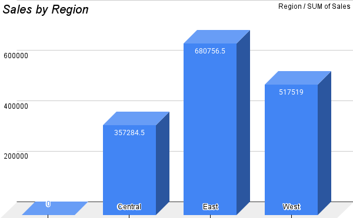
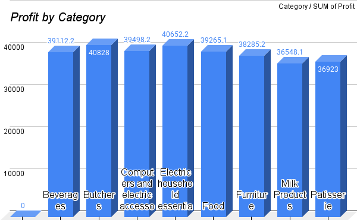
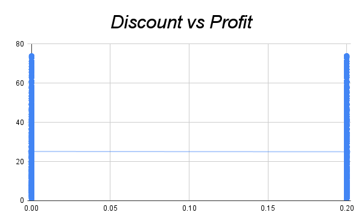
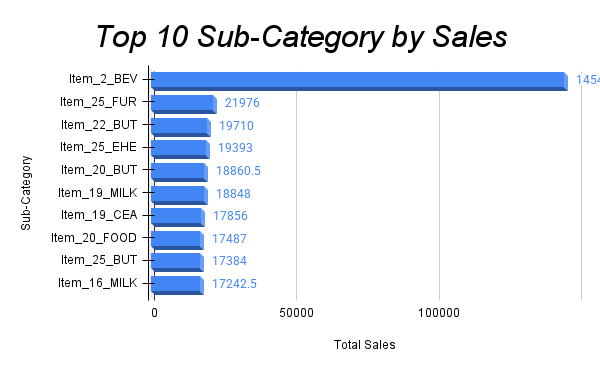

# 📊 Superstore Data Analysis

## 📌 Project Overview
Proyek ini bertujuan untuk menganalisis performa penjualan dan profit pada bisnis retail menggunakan dataset Superstore. Analisis dilakukan untuk menemukan insight bisnis yang dapat membantu pengambilan keputusan.

---

## 📊 Data Understanding
Dataset yang digunakan merupakan data transaksi retail yang mencakup beberapa variabel utama seperti:
- Category
- Sub-Category
- Sales
- Profit
- Discount
- Region

Dataset ini digunakan untuk memahami pola penjualan serta profit perusahaan.

---

## 🧹 Data Cleaning
Proses data cleaning dilakukan langsung pada file kerja dengan langkah:
- Penyesuaian nama kolom
- Penambahan data dummy (Region)
- Perhitungan estimasi profit
- Pengecekan missing value
- Pengecekan data duplikat

---

## 📈 Exploratory Data Analysis
Analisis dilakukan menggunakan beberapa visualisasi utama:

### 1. Sales by Region
Menunjukkan distribusi penjualan di setiap region.
###


### 2. Profit by Category
Menunjukkan perbandingan profit antar kategori produk.
###


### 3. Discount vs Profit
Menunjukkan hubungan antara diskon dan profit.
###


### 4. Top 10 Sub-Category
Menampilkan 10 produk dengan penjualan tertinggi.
###


---

## 💡 Key Insights
- Penjualan tidak merata di setiap region
- Tidak semua kategori menghasilkan profit tinggi
- Diskon yang tinggi cenderung menurunkan profit
- Beberapa produk mendominasi penjualan

---

## 🎯 Business Recommendation
- Mengontrol pemberian diskon agar tidak merugikan perusahaan
- Fokus pada kategori dengan profit tinggi
- Mengembangkan strategi untuk region dengan performa rendah
- Mengurangi ketergantungan pada produk tertentu

---

## 📂 Project Structure
superstore-data-analysis/
superstore-data-analysis/
```
│
├── data/            # dataset (raw & clean)
├── analysis/        # hasil analisis
├── dashboard/       # visualisasi/dashboard
├── images/          # gambar chart
└── README.md
```

---

## ⚠️ Notes
- Region merupakan data dummy
- Profit merupakan hasil estimasi
